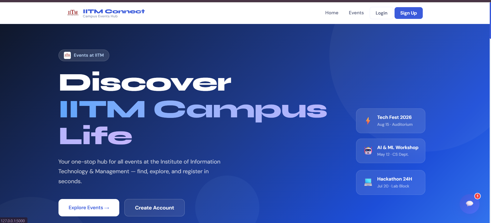
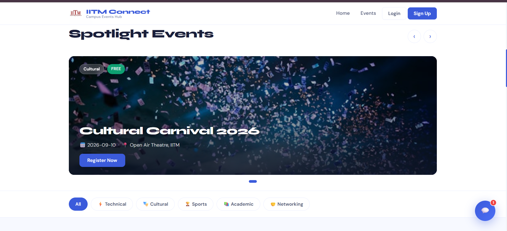
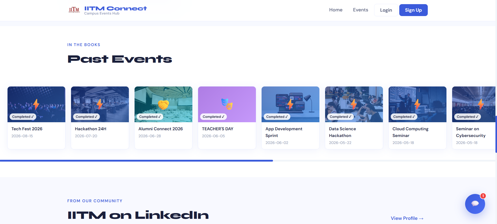
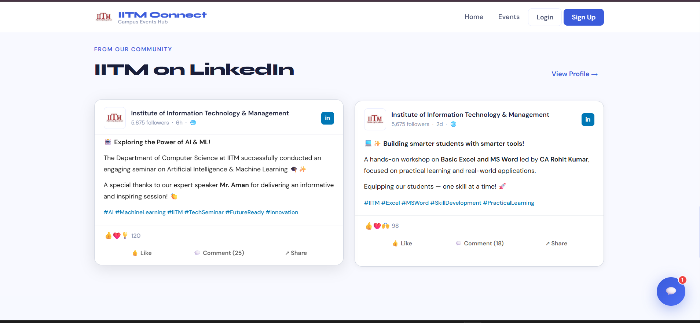
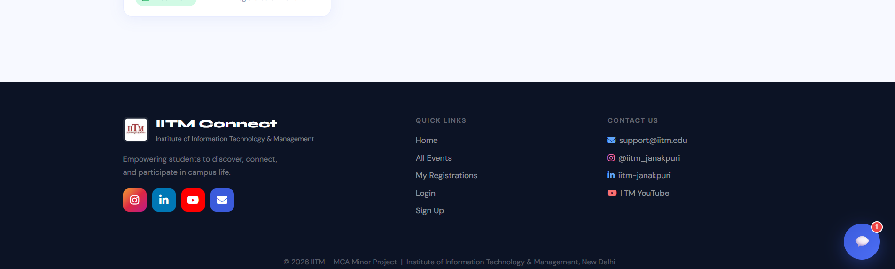
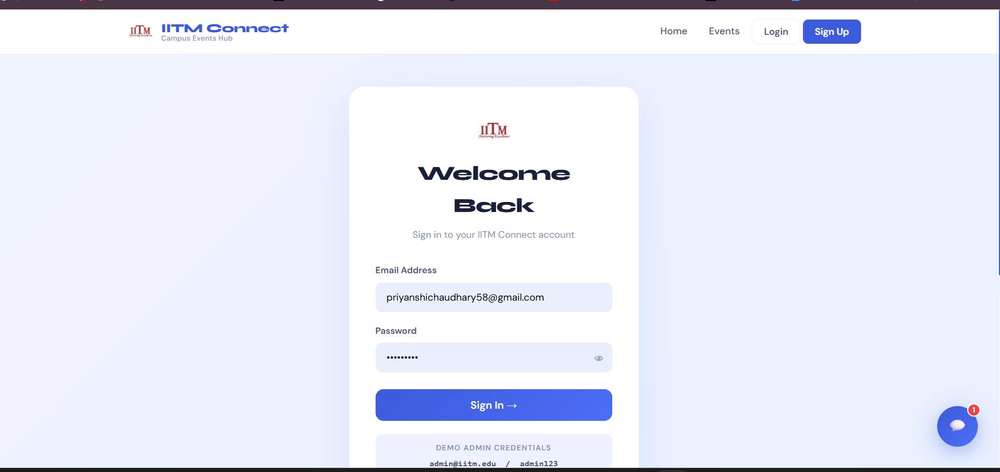
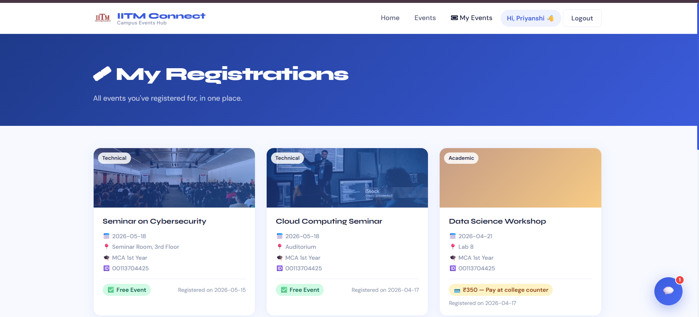
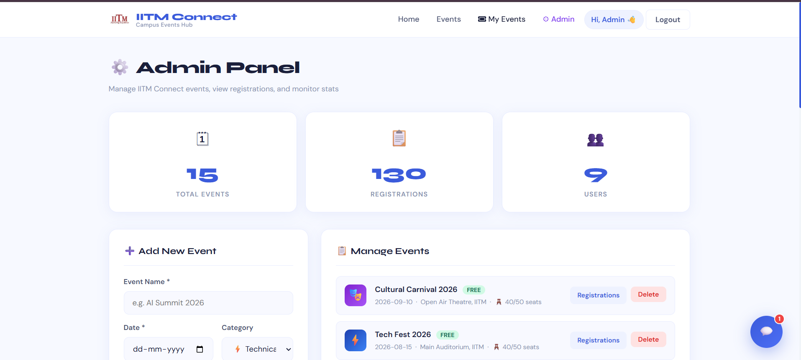
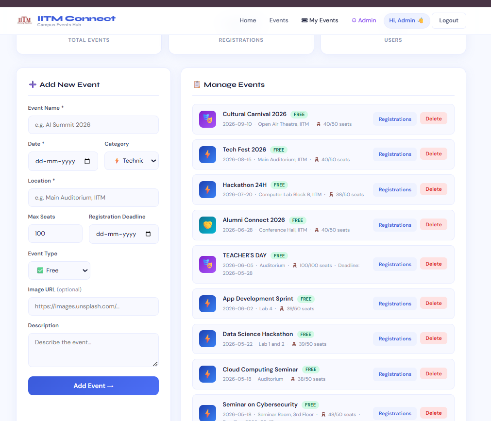

# 🎓 IITM Connect — Campus Events Hub

> A full-stack campus event management platform built for the **Institute of Information Technology & Management (IITM)**, designed to help students discover, register for, and track campus events through a centralized platform, while providing administrators with tools to manage events and registrations.


---

## 📖 Overview

**IITM Connect** is a web-based campus event management system developed as an **MCA minor project** for the Institute of Information Technology & Management.

The platform addresses a common campus problem: students often miss out on technical fests, workshops, seminars, cultural events, sports activities, and other opportunities because event information is scattered across different platforms and communication channels.

IITM Connect brings these activities together into one centralized platform where students can:

* Discover upcoming and past campus events
* Filter events by category
* View event details and available seats
* Register for events
* Track their registrations
* Get assistance through a built-in chatbot

Administrators get a dedicated dashboard to create and manage events, monitor registrations, and view platform statistics.

---

## ✨ Key Features

### 👩‍🎓 Student Features

* **Event Discovery**

  * Browse upcoming campus events from a centralized platform.
  * Spotlight carousel for featured events.
  * Dedicated archive for past events.

* **Event Categories**

  * Technical
  * Cultural
  * Sports
  * Academic
  * Networking

* **Event Registration**

  * Register directly from the event page.
  * Live seat availability.
  * Capacity-based registration limits.
  * Registration deadline information.
  * Support for both free and paid events.

* **My Registrations**

  * View all events registered by the logged-in student.
  * Track registration details and event information.
  * View applicable payment/fee status for paid events.

* **Authentication**

  * User signup and login.
  * Session-based authentication.
  * Password hashing.
  * Backend validation for user information.

* **Chatbot Assistant**

  * Built-in rule-based chatbot.
  * Responds to common event-related questions.
  * Supports queries such as:

    * *"When is Tech Fest?"*
    * *"Where is the Hackathon?"*
    * *"How do I register?"*
    * *"Show technical events."*

* **Community Section**

  * Displays campus/community highlights and LinkedIn content.

---

### 👨‍💼 Admin Features

* **Admin Dashboard**

  * Total number of events
  * Total registrations
  * Total registered users

* **Event Management**

  * Create new events.
  * Edit existing events.
  * Delete events.
  * Configure:

    * Event name
    * Date
    * Location
    * Category
    * Capacity
    * Price
    * Registration deadline
    * Banner/poster image

* **Registration Management**

  * View registrations for individual events.
  * View participant information.
  * Monitor event capacity.

* **Event Status Management**

  * Supports upcoming and past events.
  * Displays registration availability based on capacity and deadlines.

---

## 🖼️ Screenshots

### Homepage



### Spotlight Events



### Past Events



### Community Highlights



### Footer



### Login



### My Registrations



### Admin Dashboard



### Admin — Manage Events


---

## 🛠️ Tech Stack

| Layer                    | Technology                        |
| ------------------------ | --------------------------------- |
| Backend                  | Python, Flask                     |
| Database                 | SQLite                            |
| Frontend                 | HTML5, CSS3, JavaScript           |
| Templating               | Jinja2                            |
| Authentication           | Flask sessions + hashed passwords |
| Client-side Interactions | JavaScript                        |
| Chatbot                  | Rule-based intent matching        |
| Development              | Python Virtual Environment        |

---

## 📂 Project Structure

```text
iitm-connect/
│
├── app.py                         # Main Flask application
├── .gitignore                     # Files excluded from version control
├── requirements.txt               # Python dependencies
├── README.md                      # Project documentation
│
├── templates/                     # Jinja2 HTML templates
│   ├── base.html                  # Base layout shared across pages
│   ├── index.html                 # Homepage
│   ├── events.html                # Events listing page
│   ├── register.html              # Event registration page
│   ├── login.html                 # User login page
│   ├── signup.html                # User signup page
│   ├── my_registrations.html      # Student's registered events
│   ├── admin.html                 # Admin dashboard
│   ├── participants.html          # Event participant details
│   └── registrations.html         # Registration management
│
├── static/                        # Static frontend assets
│   │
│   ├── css/                       # Application stylesheets
│   │   └── ...
│   │
│   ├── js/                        # Frontend JavaScript
│   │   ├── carousel.js            # Spotlight events carousel
│   │   ├── countdown.js           # Event countdown functionality
│   │   └── main.js                # General frontend interactions
│   │
│   └── images/                    # Posters, logos and UI images
│       └── ...
│
├── screenshots/                   # Screenshots displayed in README
│   ├── 01-homepage-hero.png
│   ├── 02-spotlight-events.png
│   ├── 03-past-events.png
│   ├── 04-linkedin-community.png
│   ├── 05-footer.png
│   ├── 06-login.png
│   ├── 07-my-registrations.png
│   ├── 08-admin-panel.png
│   └── 09-admin-manage-events.png
│
└── iitm_connect.db                # Local SQLite database
```

> **Note:** `iitm_connect.db` is intended for local development and should be excluded from version control using `.gitignore`. The application can create/use the database locally when the project is run.

---

## 🚀 Getting Started

### Prerequisites

Make sure you have the following installed:

* **Python 3.9 or higher**
* **pip**
* A modern web browser

You can verify your Python installation with:

```bash
python --version
```

---

### 1. Clone the Repository

```bash
git clone https://github.com/<your-username>/iitm-connect-campus-events-hub.git
cd iitm-connect-campus-events-hub
```

---

### 2. Create a Virtual Environment

#### Windows

```bash
python -m venv venv
venv\Scripts\activate
```

#### macOS / Linux

```bash
python3 -m venv venv
source venv/bin/activate
```

---

### 3. Install Dependencies

```bash
pip install -r requirements.txt
```

---

### 4. Configure the Secret Key

For development, Flask can use a local secret key.

For a public repository or production deployment, the secret key should be stored as an environment variable rather than hardcoded in `app.py`.

#### Windows PowerShell

```powershell
$env:FLASK_SECRET_KEY="your-own-secret-key"
```

#### macOS / Linux

```bash
export FLASK_SECRET_KEY="your-own-secret-key"
```

> Never commit real secret keys, passwords, API keys, or other credentials to GitHub.

---

### 5. Run the Application

```bash
python app.py
```

The application will be available at:

```text
http://127.0.0.1:5000
```

Open the address in your browser to access IITM Connect.

---

## 🗄️ Database

IITM Connect uses **SQLite** as its database.

The database stores application data such as:

* User accounts
* Event information
* Event registrations
* Participant information
* Event capacity and registration details

The SQLite database file is intended for local development and should not be committed to a public repository.

---

## 🤖 Chatbot

IITM Connect includes a lightweight **rule-based chatbot** that helps students find event information without navigating through multiple pages.

The chatbot processes common user queries using predefined intents and pattern matching.

Example queries include:

```text
Show all events
When is Tech Fest?
Where is the Hackathon?
Tell me about AI Workshop
Show technical events
How do I register?
Show past events
```

The chatbot is exposed through the application's:

```text
/api/chatbot
```

endpoint.

---

## 🔐 Authentication & Validation

The application includes session-based authentication for students and administrators.

Security-related functionality includes:

* Password hashing
* Session-based login
* Protected admin routes
* Form validation
* Email validation
* Enrollment number validation
* Password length validation
* Registration capacity checks

For production deployment, additional security measures such as CSRF protection, stronger role-based authorization, secure cookie configuration, and production-grade database infrastructure should be added.

---

## 📌 Event Registration Flow

The general student registration flow is:

```text
Student
   │
   ▼
Browse Events
   │
   ▼
Select Event
   │
   ▼
View Event Details
   │
   ▼
Check Availability
   │
   ▼
Register
   │
   ▼
Registration Stored
   │
   ▼
View in "My Registrations"
```

Administrators can then view registered participants through the admin interface.

---

## 👨‍💼 Admin Workflow

```text
Admin Login
     │
     ▼
Admin Dashboard
     │
     ├── View Statistics
     │
     ├── Create Event
     │
     ├── Edit Event
     │
     ├── Delete Event
     │
     └── View Participants
```

---

## 📈 Future Improvements

The current system provides the core functionality required for campus event management. Future versions could include:

* 📧 Email notifications after registration
* 📱 QR-code based event check-in
* 🔐 Role-based access control with multiple admin accounts
* 💳 Payment gateway integration for paid events
* 🗃️ Migration from SQLite to PostgreSQL for production scalability
* 🔔 Event reminders and notifications
* 📊 Advanced analytics for event organizers
* 📅 Calendar integration
* 📱 Progressive Web App (PWA) support
* ☁️ Cloud deployment and production hosting
* 🧠 AI-powered chatbot with more flexible natural-language understanding

---

## 🎯 Project Objectives

The primary objectives of IITM Connect are to:

1. Centralize campus event information in one platform.
2. Simplify event discovery for students.
3. Make event registration faster and more convenient.
4. Provide students with a personal registration history.
5. Help administrators manage events and participants efficiently.
6. Reduce dependence on spreadsheets and scattered communication channels.
7. Provide a scalable foundation for a future campus-wide event management platform.

---

## 🎓 Project Context

**Project:** IITM Connect — Campus Events Hub
**Project Type:** MCA Minor Project
**Institution:** Institute of Information Technology & Management (IITM)
**University:** Guru Gobind Singh Indraprastha University (GGSIPU)

---

## 📄 License

This project is licensed under the **MIT License**.

---

## 👩‍💻 Author

**Priyanshi Kumari**

MCA Student
Guru Gobind Singh Indraprastha University

[LinkedIn](#) · [Email](mailto:priyanshichaudhary58@gmail.com)

---

⭐ If you found this project interesting, consider giving the repository a star!
